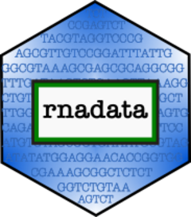

<!-- README.md is generated from README.Rmd. Please edit that file -->

```{r, include = FALSE}
library(rdataset)
knitr::opts_chunk$set(
  collapse = TRUE,
  comment = "#>",
  fig.path = "man/figures/README-",
  out.width = "100%"
)
```

# rdataset 

<!-- badges: start -->
[](https://github.com/SchlossLab/rdataset/actions/workflows/R-CMD-check.yaml)
[](https://app.codecov.io/gh/SchlossLab/rdataset?branch=main)
[](https://github.com/SchlossLab/rdataset/actions/workflows/pkgdown.yaml)
<!-- badges: end -->

## Overview 

The **rdataset** package stores the data associated with your microbial DNA analysis. This includes nucleotide sequences, abundance, sample and treatment assignments, taxonomic classifications, sequence bin assignments, 
metadata, trees and various reports. It is designed to facilitate data analysis across multiple R packages with utility functions to import from [mothur](https://mothur.org), mothur2, [qiime2](https://qiime2.org), [dada2](https://benjjneb.github.io/dada2/) and [phyloseq](https://www.bioconductor.org/packages/release/bioc/html/phyloseq.html).

* `add()` add sequences, reports, metadata, and resource references
* `assign()` assign abundances, classifications, bins, samples and treatments and more
* `names()` get the names of sequences, bins, samples, treatments and reports
* `count()` get the number of sequences, bins, samples and treatments
* `abundance()` get the abundances for sequences, bins, samples, and treatments
* `report()` get [FASTA](https://www.ncbi.nlm.nih.gov/genbank/fastaformat/) sequences, sequence and classification reports, bin assignments, sample assignments, metadata, sequence data reports, custom reports, resource references and scrapped data reports.
* `summary()` summarize sequences, your custom reports, and scrapped data

## Installation

You can install the CRAN version with:

```{r, eval = FALSE}
install.packages("rdataset")
```

### Development version

You can install the development version of rdataset from [GitHub](https://github.com/SchlossLab/rdataset) with:

```{r, eval = FALSE}
# install.packages("devtools")
devtools::install_github("SchlossLab/rdataset")
```

## Usage

The example below adds [FASTA](https://www.ncbi.nlm.nih.gov/genbank/fastaformat/) sequence data, assigns sequence abundance, samples and treatments, as well as assigning bins and taxonomic data. 

```{r}
library(rdataset)

data <- new_dataset(dataset_name = "microbial RNA example")

fasta_data <- read_fasta(rdataset_example("final.fasta"))

add(
  data = data,
  table = fasta_data,
  type = "sequences"
)

abundance_table <- readr::read_tsv(rdataset_example("mothur2_count_table.tsv"),
  show_col_types = FALSE
)
assign(
  data = data,
  table = abundance_table,
  type = "sequence_abundance",
  table_names = list(sequence_name = "names")
)

bin_table <- readr::read_tsv(
  rdataset_example(
    "mothur2_bin_assignments_list.tsv"
  ),
  show_col_types = FALSE
)

assign(
  data = data,
  table = bin_table,
  type = "bins",
  bin_type = "otu",
  table_names = list(bin_name = "otu_id", sequence_name = "seq_id")
)

sequence_classification_data <- read_mothur_taxonomy(
  taxonomy = rdataset_example("final.taxonomy")
)

assign(
  data = data,
  table = sequence_classification_data,
  type = "sequence_taxonomy"
)
data
```

## Getting help

If you encounter an issue, please file an issue on  [GitHub](https://github.com/SchlossLab/rdataset/issues). Please include a minimal 
reproducible example with your issue.

## Contributing

Is there a feature you'd like to see included, please let us know! Pull requests
are welcome on [GitHub](https://github.com/SchlossLab/rdataset/pulls). 
