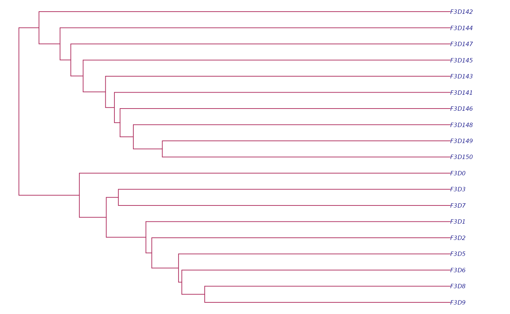

# Accessing Data

## Overview

The *strollur* package stores data associated with your microbial DNA
analysis. This tutorial will familiarize you with some of the functions
available in the *strollur* package. If you haven’t reviewed the
“Getting Started” tuturial, we recommend you start there.

## Loading the example dataset

We can use the
[`miseq_sop_example()`](https://mothur.org/strollur/reference/miseq_sop_example.md)
function to create a dataset object from the [Miseq SOP
Example](https://mothur.org/wiki/miseq_sop/).

``` r
miseq <- miseq_sop_example()
#> ℹ Added 2425 sequences.
#> ℹ Assigned 2425 sequence abundances.
#> ℹ Assigned 2425 sequence taxonomies.
#> ℹ Assigned 531 otu bins.
#> ℹ Assigned 2425 asv bins.
#> ℹ Assigned 63 phylotype bins.
#> ℹ Assigned 19 samples to treatments.
#> ℹ Assigned 531 otu bin taxonomies.
#> ℹ Assigned 531 otu bin representative sequences.
#> ℹ Added metadata.
#> ℹ Added 2 resource references.
#> ℹ Added a contigs_report.
```

To print a summary of the miseq dataset, run the following:

``` r
miseq
#> miseq_sop:
#> 
#>             starts ends nbases ambigs polymers numns   numseqs
#> Minimum:         1  375    249      0        3     0      1.00
#> 2.5%-tile:       1  375    252      0        3     0   2850.08
#> 25%-tile:        1  375    252      0        4     0  28491.75
#> Median:          1  375    252      0        4     0  56982.50
#> 75%-tile:        1  375    253      0        5     0  85473.25
#> 97.5%-tile:      1  375    253      0        6     0 111114.93
#> Maximum:         1  375    256      0        6     0 113963.00
#> Mean:            1  375    252      0        4     0      0.00
#> 
#> Number of unique seqs: 2425 
#> Total number of seqs: 113963 
#> 
#> Total number of samples: 19 
#> Total number of treatments: 2 
#> Total number of otus: 531 
#> Total number of otu bin classifications: 531 
#> Total number of asvs: 2425 
#> Total number of asv bin classifications: 2425 
#> Total number of phylotypes: 63 
#> Total number of phylotype bin classifications: 63 
#> Total number of sequence classifications: 2425 
#> Total number of resource references: 2 
#> Total number of custom reports: 1 
#> Your dataset includes metadata
```

## Accessing Your Data

The *strollur* package includes several functions to access your
microbial data.

[`names()`](https://mothur.org/strollur/reference/names.md) - The names
function is an extension of base R’s names function. It allows you to
get the name of your dataset or the names of the sequences, bins,
samples, treatments and reports in your dataset.

[`count()`](https://mothur.org/strollur/reference/count.md) - The count
function allows you to get the number of sequences, bins, samples and
treatments in your dataset.

[`abundance()`](https://mothur.org/strollur/reference/abundance.md) -
The abundance function can be used to access the abundance data for
sequences, bins, samples, and treatments.

[`report()`](https://mothur.org/strollur/reference/report.md) - The
report function can be used to access the various data associated with
your dataset.

[`summary()`](https://mothur.org/strollur/reference/summary.md) - The
summary function allows you to summarize sequences, your custom reports,
and scrapped data.

### names

The [`names()`](https://mothur.org/strollur/reference/names.md) function
allows you to get the names of sequences, bins, samples, treatments and
reports. Let’s take a closer look at how use it.

To get the name of the dataset, set the type parameter to ‘dataset’:

``` r
names(miseq, type = "dataset")
#> [1] "miseq_sop"
```

To get the names of the sequences in your dataset, set the type
parameter to ‘sequences’:

``` r
all_sequences <- names(
  miseq,
  type = "sequences",
  distinct = FALSE
)
length(all_sequences)
#> [1] 2425
head(all_sequences, n = 5)
#> [1] "M00967_43_000000000-A3JHG_1_2101_16474_12783"
#> [2] "M00967_43_000000000-A3JHG_1_1113_12711_3318" 
#> [3] "M00967_43_000000000-A3JHG_1_2108_14707_9807" 
#> [4] "M00967_43_000000000-A3JHG_1_1110_4126_16552" 
#> [5] "M00967_43_000000000-A3JHG_1_2102_8408_13436"
```

To get the names of the sequences *present* in sample ‘F3D0’:

``` r
include_f3d0 <- names(
  miseq,
  type = "sequences",
  samples = c("F3D0"),
  distinct = FALSE
)
length(include_f3d0)
#> [1] 309
head(include_f3d0, n = 5)
#> [1] "M00967_43_000000000-A3JHG_1_2103_25452_6018" 
#> [2] "M00967_43_000000000-A3JHG_1_1109_13330_21597"
#> [3] "M00967_43_000000000-A3JHG_1_1110_5315_13833" 
#> [4] "M00967_43_000000000-A3JHG_1_2104_26311_10309"
#> [5] "M00967_43_000000000-A3JHG_1_1101_9620_19745"
```

To get the names of the sequences *exclusive* to sample ‘F3D0’:

``` r
exclusive_f3d0 <- names(
  miseq,
  type = "sequences",
  samples = c("F3D0"),
  distinct = TRUE
)
length(exclusive_f3d0)
#> [1] 101
head(exclusive_f3d0, n = 5)
#> [1] "M00967_43_000000000-A3JHG_1_2103_25452_6018" 
#> [2] "M00967_43_000000000-A3JHG_1_1101_9620_19745" 
#> [3] "M00967_43_000000000-A3JHG_1_2109_17345_6668" 
#> [4] "M00967_43_000000000-A3JHG_1_1114_14431_2336" 
#> [5] "M00967_43_000000000-A3JHG_1_2106_14305_11884"
```

To get the names of the bins in your dataset, you need to specify the
bin_type. The miseq example contains 3 bin types: *otu*, *asv* and
*phylotype*. Let’s find the bin names for the ‘otu’ bin type.

``` r
otu_bins <- names(
  miseq,
  type = "bins",
  bin_type = "otu"
)
length(otu_bins)
#> [1] 531
head(otu_bins, n = 5)
#> [1] "Otu001" "Otu002" "Otu003" "Otu004" "Otu005"
```

To get the names of the ‘otu’ bins that include sequences *present* in
sample ‘F3D0’:

``` r
include_f3d0 <- names(
  miseq,
  type = "bins",
  samples = c("F3D0"),
  distinct = FALSE
)
length(include_f3d0)
#> [1] 191
head(include_f3d0, n = 5)
#> [1] "Otu001" "Otu002" "Otu003" "Otu004" "Otu005"
```

To get the names of the “otu” bins that are *exclusive* to sample
‘F3D0’:

``` r
exclusive_f3d0 <- names(
  miseq,
  type = "bins",
  samples = c("F3D0"),
  distinct = TRUE
)
length(exclusive_f3d0)
#> [1] 14
head(exclusive_f3d0, n = 5)
#> [1] "Otu330" "Otu339" "Otu341" "Otu345" "Otu347"
```

To get the names of the samples

``` r
names(miseq, type = "samples")
#>  [1] "F3D0"   "F3D1"   "F3D141" "F3D142" "F3D143" "F3D144" "F3D145" "F3D146"
#>  [9] "F3D147" "F3D148" "F3D149" "F3D150" "F3D2"   "F3D3"   "F3D5"   "F3D6"  
#> [17] "F3D7"   "F3D8"   "F3D9"
```

To get the names of the treatments

``` r
names(miseq, type = "treatments")
#> [1] "Early" "Late"
```

To get the names of the custom reports

``` r
names(miseq, type = "reports")
#> [1] "contigs_report"
```

### count

The [`count()`](https://mothur.org/strollur/reference/count.md) function
allows you to get the number of sequences, bins, samples and treatments
in your dataset.

To find the *total* number of sequences in the dataset, run the
following:

``` r
count(
  miseq,
  type = "sequences",
  distinct = FALSE
)
#> [1] 113963
```

To find the number of *unique* sequences in the dataset, set ‘distinct’
to TRUE:

``` r
count(
  miseq,
  type = "sequences",
  distinct = TRUE
)
#> [1] 2425
```

To get total number of sequences *present* in sample ‘F3D0’, you can set
the samples parameter. Note, these sequences will be present in the
sample but may be be present in other samples as well.

``` r
count(
  miseq,
  type = "sequences",
  samples = c("F3D0"),
  distinct = FALSE
)
#> [1] 6191
```

To get number of *unique* sequences *exclusive* to sample ‘F3D0’:

``` r
count(
  miseq,
  type = "sequences",
  samples = c("F3D0"),
  distinct = TRUE
)
#> [1] 101
```

To get the number of the bins in your dataset, you need to specify the
bin_type. The miseq example contains 3 bin types: *otu*, *asv* and
*phylotype*. Let’s find the number of bins for the ‘otu’ bin type.

``` r
count(
  miseq,
  type = "bins",
  bin_type = "otu"
)
#> [1] 531
```

To get number of *otu* bins with sequences *present* in sample ‘F3D0’:
*Note these bins will have sequences from sample ‘F3D0’ and may contain*
*sequences from other samples as well.*

``` r
count(
  miseq,
  type = "bins",
  bin_type = "otu",
  samples = c("F3D0"),
  distinct = FALSE
)
#> [1] 191
```

To get number of *otu* bins *exclusive* to sample ‘F3D0’: *Note these
bins will have sequences from sample ‘F3D0’ and NO other samples* *will
be present in the bins.*

``` r
count(
  miseq,
  type = "bins",
  bin_type = "otu",
  samples = c("F3D0"),
  distinct = TRUE
)
#> [1] 14
```

To get the number of samples in the dataset:

``` r
count(miseq, type = "samples")
#> [1] 19
```

To get the number of treatments in the dataset:

``` r
count(miseq, type = "treatments")
#> [1] 2
```

### abundance

Now that we are familiar with the
[`names()`](https://mothur.org/strollur/reference/names.md) and
[`count()`](https://mothur.org/strollur/reference/count.md) functions.
Let’s learn how we can use the
[`abundance()`](https://mothur.org/strollur/reference/abundance.md)
function. The abundance function can be used to access the abundance
data for sequences, bins, samples, and treatments. It returns a
data.frame containing the requested abundance data.

To the total abundance for each sequence, set the type = ‘sequences’.
This will return a 2 column data.frame containing sequence_names and
abundances.

``` r
sequence_abundance <- abundance(
  miseq,
  type = "sequences",
  by_sample = FALSE
)
head(sequence_abundance, n = 10)
#>                                  sequence_names abundances
#> 1  M00967_43_000000000-A3JHG_1_2101_16474_12783          1
#> 2   M00967_43_000000000-A3JHG_1_1113_12711_3318          1
#> 3   M00967_43_000000000-A3JHG_1_2108_14707_9807          1
#> 4   M00967_43_000000000-A3JHG_1_1110_4126_16552          1
#> 5   M00967_43_000000000-A3JHG_1_2102_8408_13436          1
#> 6  M00967_43_000000000-A3JHG_1_1107_22580_21773          1
#> 7  M00967_43_000000000-A3JHG_1_1108_14299_17220        191
#> 8   M00967_43_000000000-A3JHG_1_1114_8059_18290          1
#> 9    M00967_43_000000000-A3JHG_1_2112_9811_9982          1
#> 10  M00967_43_000000000-A3JHG_1_2103_25452_6018          1
```

To the abundance for each sequence parsed by sample, set by_sample =
TRUE. This will return a 3 or 4 column data.frame containing
sequence_names, abundances, samples and treatments (if assigned).

``` r
sequence_abundance_by_sample <- abundance(
  miseq,
  type = "sequences",
  by_sample = TRUE
)
head(sequence_abundance_by_sample, n = 10)
#>                                  sequence_names abundances samples treatments
#> 1  M00967_43_000000000-A3JHG_1_2101_16474_12783          1  F3D150       Late
#> 2   M00967_43_000000000-A3JHG_1_1113_12711_3318          1  F3D142       Late
#> 3   M00967_43_000000000-A3JHG_1_2108_14707_9807          1    F3D3      Early
#> 4   M00967_43_000000000-A3JHG_1_1110_4126_16552          1    F3D8      Early
#> 5   M00967_43_000000000-A3JHG_1_2102_8408_13436          1    F3D7      Early
#> 6  M00967_43_000000000-A3JHG_1_1107_22580_21773          1    F3D3      Early
#> 7  M00967_43_000000000-A3JHG_1_1108_14299_17220         22  F3D146       Late
#> 8  M00967_43_000000000-A3JHG_1_1108_14299_17220         19  F3D147       Late
#> 9  M00967_43_000000000-A3JHG_1_1108_14299_17220         12  F3D148       Late
#> 10 M00967_43_000000000-A3JHG_1_1108_14299_17220          9  F3D149       Late
```

To get the total abundance of the bins in your dataset, you need to
specify the bin_type. The miseq example contains 3 bin types: *otu*,
*asv* and *phylotype*. Let’s find the abundance data of bins for the
*otu* bin type. This will return a 2 column data.frame containing
bin_names and abundances.

``` r
bin_abundance <- abundance(
  miseq,
  type = "bins",
  bin_type = "otu",
  by_sample = FALSE
)
head(bin_abundance, n = 10)
#>    otu_id abundance
#> 1  Otu001     12288
#> 2  Otu002      8892
#> 3  Otu003      7794
#> 4  Otu004      7476
#> 5  Otu005      7450
#> 6  Otu006      6621
#> 7  Otu007      6304
#> 8  Otu008      5337
#> 9  Otu009      3606
#> 10 Otu010      3061
```

To the abundance for each bin parsed by sample, set by_sample = TRUE.
This will return a 3 or 4 column data.frame containing bin_names,
abundances, samples and treatments (if assigned).

``` r
bin_abundance_by_sample <- abundance(
  miseq,
  type = "bins",
  bin_type = "otu",
  by_sample = TRUE
)
head(bin_abundance_by_sample, n = 10)
#>    bin_names abundances samples treatments
#> 1     Otu001        499    F3D0      Early
#> 2     Otu001        351    F3D1      Early
#> 3     Otu001        388  F3D141       Late
#> 4     Otu001        244  F3D142       Late
#> 5     Otu001        189  F3D143       Late
#> 6     Otu001        346  F3D144       Late
#> 7     Otu001        566  F3D145       Late
#> 8     Otu001        270  F3D146       Late
#> 9     Otu001       1316  F3D147       Late
#> 10    Otu001        750  F3D148       Late
```

To access the distribution of sequences across the samples in your
dataset, set the type = ‘samples’. This will return a 2 column
data.frame containing sample names and abundances.

``` r
abundance(
  miseq,
  type = "samples"
)
#>    samples abundances
#> 1     F3D0       6191
#> 2     F3D1       4652
#> 3   F3D141       4656
#> 4   F3D142       2423
#> 5   F3D143       2403
#> 6   F3D144       3449
#> 7   F3D145       5532
#> 8   F3D146       3831
#> 9   F3D147      12430
#> 10  F3D148       9465
#> 11  F3D149      10014
#> 12  F3D150       4126
#> 13    F3D2      15686
#> 14    F3D3       5199
#> 15    F3D5       3469
#> 16    F3D6       6394
#> 17    F3D7       4055
#> 18    F3D8       4253
#> 19    F3D9       5735
```

To access the distribution of sequences across the treatments in your
dataset, set the type = ‘treatments’. This will return a 2 column
data.frame containing treatment names and abundances.

``` r
abundance(miseq, type = "treatments")
#>   treatments abundances
#> 1      Early      55634
#> 2       Late      58329
```

### report

The [`report()`](https://mothur.org/strollur/reference/report.md)
function allows you access you to access FASTA sequences, sequence and
classification reports, bin assignments, sample assignments, metadata,
sequence data reports, custom reports, resource references and scrapped
data reports. It returns a data.frame containing the requested report
data. Let’s look at some examples together.

To get a report containing the sequences
[FASTA](https://www.ncbi.nlm.nih.gov/genbank/fastaformat/) data, set the
type = “fasta”. This will be a 2 or 3 column data.frame containing
sequence names, sequence nucleotide strings, and comments (if provided).

``` r
fasta_report <- report(
  miseq,
  type = "fasta"
)
head(fasta_report, n = 5)
#>                                 sequence_names
#> 1 M00967_43_000000000-A3JHG_1_2101_16474_12783
#> 2  M00967_43_000000000-A3JHG_1_1113_12711_3318
#> 3  M00967_43_000000000-A3JHG_1_2108_14707_9807
#> 4  M00967_43_000000000-A3JHG_1_1110_4126_16552
#> 5  M00967_43_000000000-A3JHG_1_2102_8408_13436
#>                                                                                                                                                                                                                                                                                                                                                                                 sequences
#> 1 TAC--GG-AG-GAT--GCG-A-G-C-G-T-T--AT-C-CGTGAT--TT-A-T-T--GG-GT--TT-A-AA-GG-GT-GC-G-TA-GGC-G-G-A-CA-G-T-T-AA-G-T-C-A-G-C-G-G--TA-A-AA-TT-G-A-GA-GG--CT-C-AA-C-C-T-C-T-T-C--CC-G-C-CGTT-GAAAC-TG-A-TTGTC-TTGA-GT-GG-GC-GA-G-A---AG-T-A-TGTGGAATGCGTGGTGT-AGCGGT-GAAATGCATAG-AT-A-TC-AC-GC-AG-AACTCCGAT-TGCGAAGGCA------GCATA-CCG-G-CG-CC-C-A-ACTGACG-CTGA-AGCA-CGAAA-GCG-TGGGT-ATC-GAACAGG
#> 2 TAC--GT-AG-GGG--GCA-A-G-C-G-T-T--AT-C-CGG-AT--TT-A-C-T--GG-GT--GT-A-AA-GG-GA-GC-G-TA-GGC-G-G-C-CA-T-G-C-AA-G-T-C-A-G-A-A-G--TG-A-AA-AC-C-C-GG-GG--CT-C-AA-C---C-C-TGG-G-AGT-G-C-TTTT-GAAAC-TG-T-GCGGC-TAGA-GT-GT-CG-GA-G-G---GG-T-A-AGTGGAATTCCTAGTGT-AGCGGT-GAAATGCGTAG-AT-A-TT-AG-GA-GG-AACACCAGT-GGCGAAGGCG------GCTTA-CTG-G-AC-GA-T-G-ACTGACG-CTGA-GGCT-CGAAA-GCG-TGGGT-ATC-GAACAGG
#> 3 TAC--GG-AG-GAT--GCG-A-G-C-G-T-T--AT-C-CGG-AT--TT-A-C-T--GG-GT--GT-A-AA-GG-GA-GC-G-TA-GAC-G-G-C-GG-C-G-C-AA-G-T-C-T-G-A-A-G--TG-A-AA-GC-C-C-GT-GG--CT-C-AA-C-C-G-C-G-G-A-ACC-G-C-TTTG-GAAAC-TG-C-GAGGC-TGGA-GT-GC-TG-GA-G-A---GG-T-A-AGCGGAATTCCTGGTGT-AGCGGT-GAAATGCGTAG-AT-A-TC-AG-GA-GG-AACACCGGT-GGCGAAGGCG------GCTTA-CTG-G-AC-AG-T-G-ACTGACG-TTGA-GGCT-CGAAA-GCG-TGGGG-AGC-GAACAGG
#> 4 TAC--GG-AG-GAT--TCA-A-G-C-G-T-T--AT-C-CGG-AT--TT-A-T-T--GG-GT--TT-A-AA-GG-GT-GC-G-TA-GGC-G-G-G-CT-G-T-T-AA-G-T-C-A-G-C-G-G--TC-A-AA-TG-T-C-GG-GG--CT-C-AA-C-C-C-C-G-G-C--CT-G-C-CGTT-GAAAC-TG-G-CGGCC-TCGA-GT-GG-GC-GA-G-A---AG-T-A-TGCGGAATGCGTGGTGT-AGCGGT-GAAATGCATAG-AT-A-TC-AC-GC-AG-AACTCCGAT-TGCGAAGGCA------GCATA-CCG-G-CG-CC-C-T-ACTGACG-CTGA-GGCA-CGAAA-GCG-TGGGT-ATC-GAACAGG
#> 5 TAC--GG-AG-GGG--GCA-A-G-C-G-T-T--AT-C-CGG-AT--TT-A-C-T--GG-GT--GT-A-AA-GG-GA-GC-G-TA-GGC-G-G-C-AG-T-G-C-AA-G-T-C-A-G-A-A-G--TG-A-AA-GC-C-C-AA-GG--CT-C-AA-C---C-A-TGG-G-ACT-G-C-TTTT-GAAAC-TG-T-ACAGC-TAGA-TT-GC-AG-GA-G-A---GG-T-A-AGTGGAATTCCTAGTGT-AGCGGT-GAAATGCGTAG-AT-A-TT-AG-GA-GG-AACACCAGT-GGCGAAGGCG------GCTTA-CTG-G-AC-TG-T-A-AATGACG-CTGA-GGCT-CGAAA-GCG-TGGGG-AGC-AAACAGG
```

If you want to take a closer look at the sequences, you can request a
report containing the sequence names, starts, ends, lengths, ambiguous
bases, longest homopolymers, and number of N’s. To get a sequence
report, set type = “sequences”.

``` r
sequence_report <- report(
  miseq,
  type = "sequences"
)
head(sequence_report, n = 5)
#>                                             id start end length ambig
#> 1 M00967_43_000000000-A3JHG_1_2101_16474_12783     1 375    253     0
#> 2  M00967_43_000000000-A3JHG_1_1113_12711_3318     1 375    253     0
#> 3  M00967_43_000000000-A3JHG_1_2108_14707_9807     1 375    253     0
#> 4  M00967_43_000000000-A3JHG_1_1110_4126_16552     1 375    252     0
#> 5  M00967_43_000000000-A3JHG_1_2102_8408_13436     1 375    253     0
#>   longest_homopolymer num_n
#> 1                   4     0
#> 2                   5     0
#> 3                   4     0
#> 4                   4     0
#> 5                   5     0
```

The report function also allows you to access classification reports
about your dataset. There are 2 types of classification reports:
*sequence_taxonomy* and *bin_taxonomy*. To get a report about the
sequence classifications, set type = “sequence_taxonomy”. This will
create a 3 or 4 column report containing sequence names, taxonomic
levels, taxons and confidence scores(if provided).

``` r
sequence_classification <- report(
  miseq,
  type = "sequence_taxonomy"
)
head(sequence_classification, n = 10)
#>                                              id level
#> 1  M00967_43_000000000-A3JHG_1_2101_16474_12783     1
#> 2  M00967_43_000000000-A3JHG_1_2101_16474_12783     2
#> 3  M00967_43_000000000-A3JHG_1_2101_16474_12783     3
#> 4  M00967_43_000000000-A3JHG_1_2101_16474_12783     4
#> 5  M00967_43_000000000-A3JHG_1_2101_16474_12783     5
#> 6  M00967_43_000000000-A3JHG_1_2101_16474_12783     6
#> 7   M00967_43_000000000-A3JHG_1_1113_12711_3318     1
#> 8   M00967_43_000000000-A3JHG_1_1113_12711_3318     2
#> 9   M00967_43_000000000-A3JHG_1_1113_12711_3318     3
#> 10  M00967_43_000000000-A3JHG_1_1113_12711_3318     4
#>                                taxon confidence
#> 1                           Bacteria        100
#> 2                    "Bacteroidetes"        100
#> 3                      "Bacteroidia"         99
#> 4                    "Bacteroidales"         99
#> 5               "Porphyromonadaceae"         88
#> 6  "Porphyromonadaceae"_unclassified         88
#> 7                           Bacteria        100
#> 8                         Firmicutes        100
#> 9                         Clostridia        100
#> 10                     Clostridiales        100
```

To get the consensus taxonomies assigned to the bins in your dataset,
you need to specify the bin_type. The miseq example contains 3 bin
types: *otu*, *asv* and *phylotype*. Let’s find the consensus taxonomies
of bins for the *otu* bin type.

``` r
bin_classification <- report(
  miseq,
  type = "bin_taxonomy",
  bin_type = "otu"
)
head(bin_classification, n = 10)
#>        id level                             taxon confidence
#> 1  Otu001     1                          Bacteria        100
#> 2  Otu001     2                   "Bacteroidetes"        100
#> 3  Otu001     3                     "Bacteroidia"        100
#> 4  Otu001     4                   "Bacteroidales"        100
#> 5  Otu001     5              "Porphyromonadaceae"        100
#> 6  Otu001     6 "Porphyromonadaceae"_unclassified        100
#> 7  Otu002     1                          Bacteria        100
#> 8  Otu002     2                   "Bacteroidetes"        100
#> 9  Otu002     3                     "Bacteroidia"        100
#> 10 Otu002     4                   "Bacteroidales"        100
```

To get the sequence bin assignments for the *otu* bins, run the
following:

``` r
sequence_bin_assignments <- report(
  miseq,
  type = "sequence_bin_assignments",
  bin_type = "otu"
)
head(sequence_bin_assignments, n = 10)
#>    otu_id                                       seq_id
#> 1  Otu001  M00967_43_000000000-A3JHG_1_1111_20933_6700
#> 2  Otu001  M00967_43_000000000-A3JHG_1_1113_17095_9759
#> 3  Otu001 M00967_43_000000000-A3JHG_1_1114_22144_24942
#> 4  Otu001   M00967_43_000000000-A3JHG_1_1112_5981_8948
#> 5  Otu001  M00967_43_000000000-A3JHG_1_2106_5509_18056
#> 6  Otu001 M00967_43_000000000-A3JHG_1_1112_18411_17052
#> 7  Otu001 M00967_43_000000000-A3JHG_1_1101_20262_22075
#> 8  Otu001 M00967_43_000000000-A3JHG_1_1114_13556_18457
#> 9  Otu001 M00967_43_000000000-A3JHG_1_2114_12634_10967
#> 10 Otu001 M00967_43_000000000-A3JHG_1_1102_18640_14309
```

To get the sample treatment assignments, set type =
“sample_assignments”.

``` r
sample_treatment_assignments <- report(
  miseq,
  type = "sample_assignments"
)
head(sample_treatment_assignments, n = 5)
#>   samples treatments
#> 1    F3D0      Early
#> 2    F3D1      Early
#> 3  F3D141       Late
#> 4  F3D142       Late
#> 5  F3D143       Late
```

If you assigned bin representative sequences, you can access the report
by setting type = “bin_representatives”. The miseq example includes bin
representatives for the *otu* bins. Let’s take a look:

``` r
otu_bin_representatives <- report(
  miseq,
  type = "bin_representatives",
  bin_type = "otu"
)
head(otu_bin_representatives, n = 5)
#>   otu_names                         representative_names
#> 1    Otu001 M00967_43_000000000-A3JHG_1_1108_14299_17220
#> 2    Otu002  M00967_43_000000000-A3JHG_1_1106_22705_6123
#> 3    Otu003  M00967_43_000000000-A3JHG_1_1101_15533_5293
#> 4    Otu004 M00967_43_000000000-A3JHG_1_1105_25642_17588
#> 5    Otu005  M00967_43_000000000-A3JHG_1_2102_7041_13746
#>                                                                                                                                                                                                                                                                                                                                                                  representative_sequences
#> 1 TAC--GT-AG-GGG--GCA-A-G-C-G-T-T--AT-C-CGG-AT--TT-A-C-T--GG-GT--GT-A-AA-GG-GA-GC-G-TA-GAC-G-G-C-TG-T-G-C-AA-G-T-C-T-G-A-A-G--TG-A-AA-TG-C-C-GG-GG--CT-C-AA-C-C-C-C-G-G-A-ACT-G-C-TTTG-GAAAC-TG-T-ACAGC-TAGA-GT-GC-AG-GA-G-G---GG-T-G-AGCGGAATTCCTAGTGT-AGCGGT-GAAATGCGTAG-AT-A-TT-AG-GA-GG-AACACCGGT-GGCGAAGGCG------GCTCA-CTG-G-AC-TG-T-A-ACTGACG-TTGA-GGCT-CGAAA-GCG-TGGGG-AGC-AAACAGG
#> 2 TAC--GT-AG-GGG--GCA-A-G-C-G-T-T--AT-C-CGG-AT--TT-A-C-T--GG-GT--GT-A-AA-GG-GA-GC-G-CA-GAC-G-G-C-TG-T-G-C-AA-G-T-C-T-G-G-A-G--TG-A-AA-GG-C-G-GG-GG--CC-C-AA-C-C-C-C-C-G-G-ACT-G-C-TCTG-GAAAC-TG-T-AAAGC-TGGA-GT-GC-AG-GA-G-A---GG-T-A-AGCGGAATTCCTAGTGT-AGCGGT-GAAATGCGTAG-AT-A-TT-AG-GA-GG-AACACCAGT-GGCGAAGGCG------GCTTA-CTG-G-AC-TG-C-A-ACTGACG-TTGA-GGCT-CGAAA-GCG-TGGGT-ATC-GAACAGG
#> 3 TAC--GG-AG-GAT--GCG-A-G-C-G-T-T--AT-C-CGG-AT--TT-A-C-T--GG-GT--GT-A-AA-GG-GA-GC-G-TA-GAC-G-G-C-GA-T-G-C-AA-G-T-C-T-G-A-A-G--TG-A-AA-GG-C-G-GG-GG--CC-C-AA-C-C-C-C-C-G-G-ACT-G-C-TTTG-GAAAC-TG-T-ATAGC-TGGA-GT-GC-AG-GA-G-A---GG-T-A-AGTGGAATTCCTAGTGT-AGCGGT-GAAATGCGTAG-AT-A-TT-AG-GA-GG-AACACCAGT-GGCGAAGGCG------GCTTA-CTG-G-AC-TG-T-A-ACTGACG-TTGA-GGCT-CGAAA-GCG-TGGGG-AGC-AAACAGG
#> 4 TAC--GT-AG-GTG--GCA-A-G-C-G-T-T--AT-C-CGG-AT--TT-A-C-T--GG-GT--GT-A-AA-GG-GC-GT-G-TA-GGC-G-G-G-AC-T-G-C-AA-G-T-C-A-G-A-T-G--TG-A-AA-CC-C-A-TG-GG--CT-C-AA-C-C-C-A-T-G-G-CCT-G-C-ATTT-GAAAC-TG-T-AGTTC-TTGA-GT-GA-TG-GA-G-A---GG-C-A-GGCGGAATTCCGTGTGT-AGCGGT-GAAATGCGTAG-AT-A-TA-CG-GA-GG-AACACCAGT-GGCGAAGGCG------GCCTG-CTG-G-AC-AT-T-A-ACTGACG-CTGA-GGCG-CGAAA-GCG-TGGGG-AGC-AAACAGG
#> 5 TAC--GT-AG-GGG--GCG-A-G-C-G-T-T--AT-C-CGG-AT--TC-A-T-T--GG-GC--GT-A-AA-GC-GC-GC-G-CA-GGC-G-G-A-CT-C-A-T-AA-G-C-G-G-A-G-C-C--TT-T-AA-TC-T-T-GG-GG--CT-T-AA-C-C-T-C-A-A-G-T-C-G-G-GCCC-CGAAC-TG-T-GAGTC-TCGA-GT-GT-GG-TA-G-G---GG-A-A-GGCGGAATTCCCGGTGT-AGCGGT-GGAATGCGCAG-AT-A-TC-GG-GA-AG-AACACCGAT-GGCGAAGGCA------GCCTT-CTG-G-GC-CA-T-C-ACTGACG-CTGA-GGCG-CGAAA-GCT-AGGGG-AGC-AAACAGG
```

The miseq example contains a custum report. To access the custom
reports, first let’s find the names.

``` r
names(miseq, type = "reports")
#> [1] "contigs_report"
```

To access the custom contigs assembly report, set type =
“contigs_report”.

``` r
contigs_assembly_report <- report(
  miseq,
  type = "contigs_report"
)
head(contigs_assembly_report, n = 5)
#>                                           Name Length Overlap_Length
#> 1 M00967_43_000000000-A3JHG_1_2101_16474_12783    253            250
#> 2  M00967_43_000000000-A3JHG_1_1113_12711_3318    253            249
#> 3  M00967_43_000000000-A3JHG_1_2108_14707_9807    253            249
#> 4  M00967_43_000000000-A3JHG_1_1110_4126_16552    252            249
#> 5  M00967_43_000000000-A3JHG_1_2102_8408_13436    253            249
#>   Overlap_Start Overlap_End MisMatches Num_Ns Expected_Errors
#> 1             2         252         19      0      0.29461400
#> 2             2         251          0      0      0.00183396
#> 3             2         251          0      0      0.00196774
#> 4             2         251          4      0      0.05629750
#> 5             2         251          0      0      0.00259554
```

To get the metadata associated with your dataset, set type = “metadata”.

``` r
metadata <- report(
  miseq,
  type = "metadata"
)
head(metadata, n = 5)
#>   sample days_post_wean
#> 1   F3D0              0
#> 2   F3D1              1
#> 3 F3D141            141
#> 4 F3D142            142
#> 5 F3D143            143
```

To get the resource references associated with your dataset, set type =
“references”.

``` r
report(
  miseq,
  type = "references"
)
#>            reference_names reference_versions         reference_usages
#> 1 trainset9_032012.pds.zip                 NA classification by mothur
#> 2           silva.v4.fasta             1.38.1                alignment
#>                                                              reference_notes
#> 1                                                                         NA
#> 2 custom reference created by trimming silva.bacteria.fasta to the V4 region
#>                                                            reference_urls
#> 1 https://mothur.s3.us-east-2.amazonaws.com/wiki/trainset9_032012.pds.zip
#> 2                          https://mothur.org/wiki/silva_reference_files/
```

Lastly, if sequences or bins have been removed over the course of your
analysis you can see a report about the scrapped data by setting type =
“sequence_scrap” or “bin_scrap”. The miseq example does not include
scrapped data, but let’s take a look at how to access it.

``` r
report(
  miseq,
  type = "sequence_scrap"
)
#> data frame with 0 columns and 0 rows
report(
  miseq,
  type = "bin_scrap"
)
#> data frame with 0 columns and 0 rows
```

### summary

The [`summary()`](https://mothur.org/strollur/reference/summary.md)
function allows you to summarize sequences, custom reports, and scrapped
data.

To get a summary for our custom reports, first let’s find the report
names.

``` r
names(miseq, type = "reports")
#> [1] "contigs_report"
```

You can see we have a custom report so let get the summary by setting
report_type = “contigs_report”.

``` r
summary(
  miseq,
  type = "reports",
  report_type = "contigs_report"
)
#>             Expected_Errors   Length MisMatches Num_Ns Overlap_End
#> Minimum:       0.0000452496 250.0000   0.000000      0    248.0000
#> 2.5%-tile:     0.0016101600 252.0000   0.000000      0    251.0000
#> 25%-tile:      0.0028177700 252.0000   0.000000      0    251.0000
#> Median:        0.0062948698 252.0000   2.000000      0    251.0000
#> 75%-tile:      0.0264780000 253.0000   4.000000      0    251.0000
#> 97.5%-tile:    1.1412299871 253.0000  76.000000      0    252.0000
#> Maximum:       3.0126200000 270.0000 120.000000      0    256.0000
#> Mean:          0.0984788569 252.5128   7.534147      0    251.0762
#>             Overlap_Length Overlap_Start
#> Minimum:          232.0000      0.000000
#> 2.5%-tile:        248.0000      1.000000
#> 25%-tile:         249.0000      2.000000
#> Median:           249.0000      2.000000
#> 75%-tile:         249.0000      2.000000
#> 97.5%-tile:       251.0000      3.000000
#> Maximum:          255.0000     22.000000
#> Mean:             249.2136      1.862692
#>             Expected_Errors   Length MisMatches Num_Ns Overlap_End
#> Minimum:       0.0000452496 250.0000   0.000000      0    248.0000
#> 2.5%-tile:     0.0016101600 252.0000   0.000000      0    251.0000
#> 25%-tile:      0.0028177700 252.0000   0.000000      0    251.0000
#> Median:        0.0062948698 252.0000   2.000000      0    251.0000
#> 75%-tile:      0.0264780000 253.0000   4.000000      0    251.0000
#> 97.5%-tile:    1.1412299871 253.0000  76.000000      0    252.0000
#> Maximum:       3.0126200000 270.0000 120.000000      0    256.0000
#> Mean:          0.0984788569 252.5128   7.534147      0    251.0762
#>             Overlap_Length Overlap_Start
#> Minimum:          232.0000      0.000000
#> 2.5%-tile:        248.0000      1.000000
#> 25%-tile:         249.0000      2.000000
#> Median:           249.0000      2.000000
#> 75%-tile:         249.0000      2.000000
#> 97.5%-tile:       251.0000      3.000000
#> Maximum:          255.0000     22.000000
#> Mean:             249.2136      1.862692
```

Lastly, if sequences or bins have been removed over the course of your
analysis you can see a summary about the scrapped data by setting type =
“scrap”. The miseq example does not include scrapped data, but let’s
take a look at how to access it.

``` r
summary(miseq, type = "scrap")
#> data frame with 0 columns and 0 rows
#> data frame with 0 columns and 0 rows
```

## Sample Trees and Sequence Trees

strollur allows you to include trees relating the sequences and samples
within your dataset. You can access and plot them using the following
functions.

``` r
miseq_sequence_tree <- miseq$get_sequence_tree()
miseq_sample_tree <- miseq$get_sample_tree()

#| fig.alt: >
#|   Plot of Miseq_SOP's sample relationship tree
par(bg = "white")
ape::plot.phylo(miseq_sample_tree,
  no.margin = TRUE,
  cex = 0.5, edge.color = "maroon", tip.color = "navy"
)
```



Thanks for following along. Next, find out how to import your own data
using the links below:

- [General
  Importing](https://mothur.org/strollur/articles/vignettes/General_Importing.md)
- [Importing data from
  qiime2](https://mothur.org/strollur/articles/vignettes/Importing_from_qiime2.md)
- [Importing data from
  mothur](https://mothur.org/strollur/articles/vignettes/Importing_from_mothur.md)
