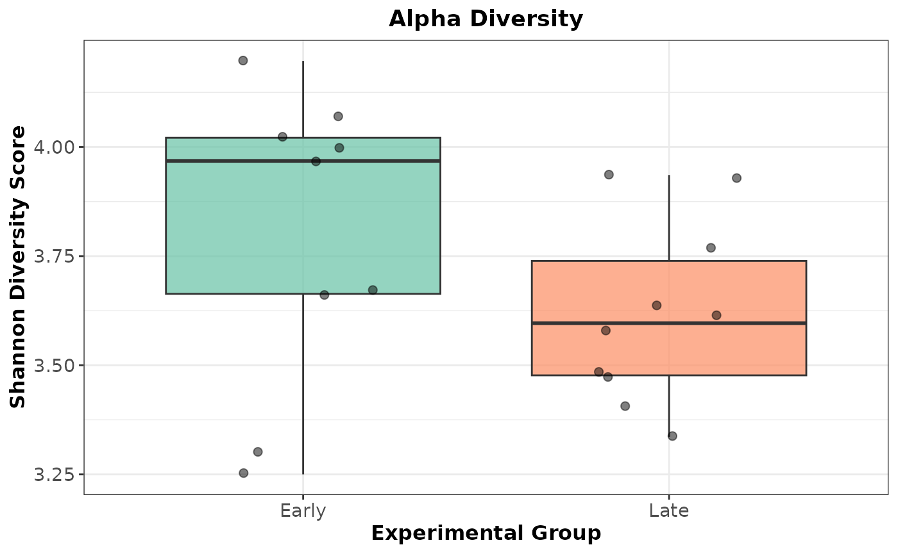
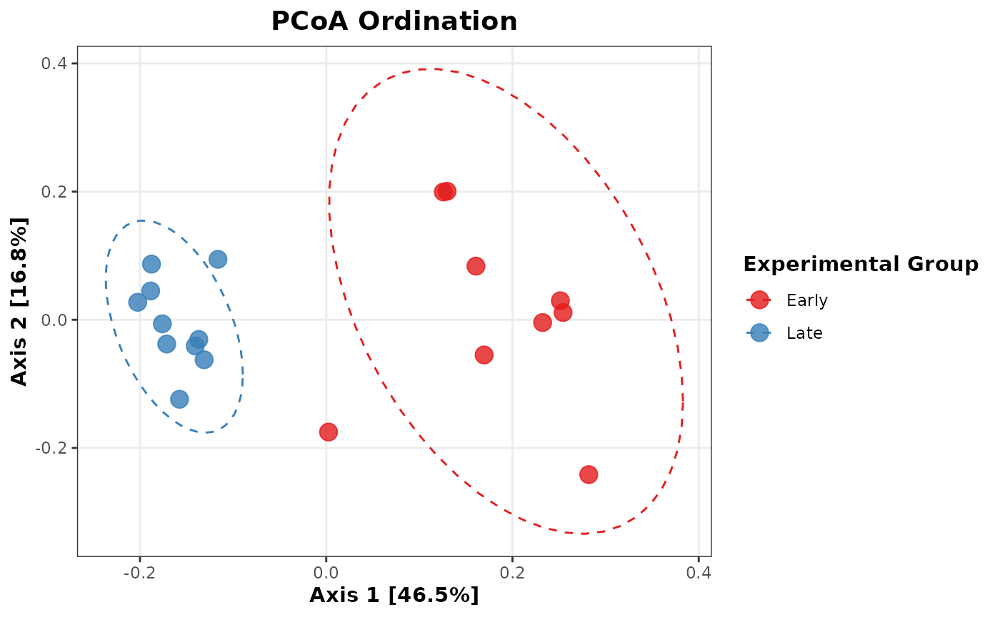

# Example Analysis Across Software Tools

## Overview

One of the challenges of Amplicon Sequence Data Analysis is transferring
data between software tools. The `strollur` package is designed to make
that process seamless. This tutorial will demonstrate a workflow using
mothur to preprocess and bin the data, `strollur` to store and transfer
the data, `phylotypr` to classify the data, `phyloseq` to calculate the
alpha and beta diversities and `ggplot2` to create visuals.

``` r

if (!requireNamespace("ggplot2", quietly = TRUE) ||
      !requireNamespace("phylotypr", quietly = TRUE) ||
      !requireNamespace("phyloseq", quietly = TRUE)) {
  message(paste(
    "Suggested packages 'ggplot2', 'phyloseq' or 'phylotypr'",
    "are not installed."
  ))
  knitr::opts_chunk$set(eval = FALSE)
} else {
  library(strollur)
  library(phylotypr)
  library(phyloseq)
  library(ggplot2)
}
#> 
#> Attaching package: 'strollur'
#> The following objects are masked from 'package:base':
#> 
#>     assign, names, summary
#> 
#> Attaching package: 'phylotypr'
#> The following objects are masked from 'package:strollur':
#> 
#>     read_fasta, write_fasta
```

## Import from mothur

Let’s create a strollur object from [mothur’s](https://mothur.org)
[Miseq SOP Example](https://mothur.org/wiki/miseq_sop/) output files.

``` r

strollur_data <- read_mothur(
  fasta = strollur_example("final.fasta.gz"),
  count = strollur_example("final.count_table.gz"),
  design = strollur_example("mouse.time.design"),
  otu_list = strollur_example("final.opti_mcc.list.gz"),
  asv_list = strollur_example("final.asv.list.gz"),
  phylo_list = strollur_example("final.tx.list.gz"),
  sample_tree = strollur_example("final.opti_mcc.jclass.ave.tre"),
  sequence_tree = strollur_example("final.phylip.tre.gz"),
  dataset_name = "miseq_sop"
)
#> Added 2425 sequences.
#> Assigned 2425 sequence abundances.
#> Assigned 531 otu bins.
#> Assigned 2425 asv bins.
#> Assigned 63 phylotype bins.
#> Assigned 19 samples to treatments.

metadata <- readRDS(strollur_example("miseq_metadata.rds"))
add(strollur_data, table = metadata, type = "metadata")
#> Added metadata.
```

## Classify using phylotypr

[`phylotypr`](https://mothur.org/phylotypr/) provides an R-based
implementation of a [naive Bayesian
Classifier](https://pubmed.ncbi.nlm.nih.gov/17586664/). It is designed
and maintained by the [Schloss Lab](https://www.schlosslab.org) and
accepts a strollur object as an input to the `classify_sequences`
function. It also includes built in reference databases for your use.

``` r

database_reference <- build_kmer_database(trainset9_pds)
classify_sequences(strollur_data, database_reference)
```

## Diversity Analysis using phyloseq

We can use strollur’s write functions to create [phyloseq
object](https://www.bioconductor.org/packages/release/bioc/html/phyloseq.html)
from the strollur object and calculate the Shannon Index and Principal
Coordinates Analysis (PCoA) values using phyloseq.

``` r

phyloseq_data <- write_phyloseq(strollur_data)
phyloseq_data
#> phyloseq-class experiment-level object
#> otu_table()   OTU Table:         [ 2425 taxa and 19 samples ]
#> sample_data() Sample Data:       [ 19 samples by 2 sample variables ]
#> phy_tree()    Phylogenetic Tree: [ 2425 tips and 2424 internal nodes ]

alpha_div <- phyloseq::estimate_richness(phyloseq_data,
  measures = "Shannon"
)

metadata <- data.frame(sample_data(phyloseq_data))
shannon_plot_data <- cbind(metadata, Shannon = alpha_div$Shannon)

ps_rel <- transform_sample_counts(
  phyloseq_data,
  function(x) x / sum(x)
)
pcoa_ord <- ordinate(ps_rel, method = "PCoA", distance = "bray")
```

## Create publication-ready plots grouped by treatment

### Plot the Shannon Alpha Diversity as a boxplot:

``` r

ggplot2::ggplot(shannon_plot_data, aes(
  x = treatment,
  y = Shannon,
  fill = treatment
)) +
  geom_boxplot(alpha = 0.7, outlier.shape = NA) +
  geom_jitter(width = 0.2, size = 2, alpha = 0.5) +
  scale_fill_brewer(palette = "Set2") +
  labs(
    title = "Alpha Diversity",
    x = "Experimental Group",
    y = "Shannon Diversity Score"
  ) +
  theme_bw() +
  theme(
    legend.position = "none",
    plot.title = element_text(face = "bold", hjust = 0.5),
    axis.text = element_text(size = 11),
    axis.title = element_text(size = 12, face = "bold")
  )
```



### Plot PCoA Beta Diversity:

``` r

pcoa_df <- plot_ordination(ps_rel, pcoa_ord, justDF = TRUE)

ggplot2::ggplot(pcoa_df, aes(x = Axis.1, y = Axis.2, color = treatment)) +
  geom_point(size = 4, alpha = 0.8) +
  stat_ellipse(aes(group = treatment), linetype = 2, level = 0.95) +
  scale_color_brewer(palette = "Set1") +
  labs(
    title = "PCoA Ordination",
    x = paste0(
      "Axis 1 [",
      round(pcoa_ord$values$Relative_eig[1] * 100, 1), "%]"
    ),
    y = paste0(
      "Axis 2 [",
      round(pcoa_ord$values$Relative_eig[2] * 100, 1), "%]"
    ),
    color = "Experimental Group"
  ) +
  theme_bw() +
  theme(
    plot.title = element_text(face = "bold", hjust = 0.5, size = 14),
    axis.title = element_text(face = "bold", size = 11),
    legend.title = element_text(face = "bold"),
    panel.grid.minor = element_blank()
  )
```



## Deep Dive

The `strollur` package includes several built in read and write
functions to allow you to easily import your Amplicon Sequence data from
your favorite software tools. Check out the tutorials below to learn
more about imports and data transfers.

- [General
  Importing](https://mothur.org/strollur/articles/General_Importing.html)
- [Importing data from
  mothur](https://mothur.org/strollur/articles/Importing_from_mothur.html)
- [Importing data from
  qiime2](https://mothur.org/strollur/articles/Importing_from_qiime2.html)
- [Importing data from
  phyloseq](https://mothur.org/strollur/articles/Importing_from_phyloseq.html)
- [Data
  Transfers](https://mothur.org/strollur/articles/Data_Transfers.html)
